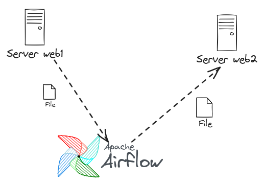
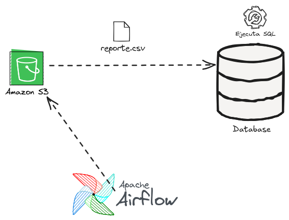

# Apache Airflow


# Automatizando tareas con Apache Airflow

Ponencia para el Freedom Software Day Quito - 2024

# Stack utilizado
- Docker
- Docker Compose

## Primer Caso
Copia de archivos desde un servidor hacia otro mediante mediante tarea programada.

### Arquitectura



- Servidor 1: Servidor web con apache php y servicio ssh
- Servidor 2: Servidor web con apache php y servicio ssh
- Apache airflow

## Segundo Caso

### Arquitectura



- Bucket de S3
- Apache airflow
- Servidor de Bd Postgres


## Pasos para levantar el proyecto
1. Clonar el repo

```
git clone https://github.com/juliosarango/airflow_ponencia.git
```

2. Levantar los contenedores. 

```
cd airflow_ponencia
docker compose -f airflow/docker-compose.yaml up --d
docker compose -f web/docker-compose.yaml start

```

3. Levantar servicio ssh en contenedores web1m web2 y postgres_db

```
docker exec -ti web1 bash
service sshd start

docker exec -ti web2 bash
service sshd start

docker exec -ti postgres_db bash
service ssh start
```

4. Crear path de archivos es servidor web1 y web2 y airflow-airflow-worker-1. Revisar permisos asignados
```
docker exec -ti web1 bash
mkdir -p /var/www/html/web1/files_web1/
chmod 777 /var/www/html/web1/files_web1/

docker exec -ti web2 bash
/var/www/html/web1/files_web2/
/var/www/html/web1/files_web2/

docker exec -ti airflow-airflow-worker-1 bash
mkdir /opt/airflow/files
chmod 777 /opt/airflow/files

```

5. Ingresar al Apache Airflow puertos 8080:
```
localhost:8080
```

Bajo Admin->Variables crear las siguientes entradas, o en su defecto acceder a la bd postgres de apache airflow y ejecutar el siguiente query

```
INSERT INTO public.variable ("key",val,description,is_encrypted) VALUES
	 ('email_notificacion','youremail@gmail.com','',false),
	 ('path_web_1','/var/www/html/web1/files_web1/','',false),
	 ('path_web_2','/var/www/html/web2/files_web2/','',false),
	 ('path_local','/opt/airflow/files/','',false);
```


2. Crear variables bajo el menú 