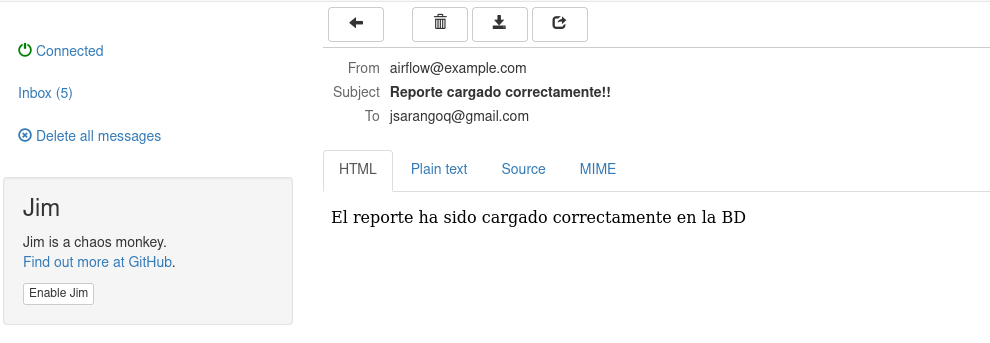

# Apache Airflow


# Automatizando tareas con Apache Airflow

Ponencia para el Freedom Software Day Quito - 2024

# Stack utilizado
- Docker
- Docker Compose

## Primer Caso
Copia de archivos desde un servidor hacia otro mediante mediante tarea programada.

### Arquitectura


- Servidor 1: Servidor web con apache php y servicio ssh
- Servidor 2: Servidor web con apache php y servicio ssh
- Apache airflow

## Segundo Caso

### Arquitectura


- Bucket de S3
- Apache airflow
- Servidor de Bd Postgres


## Pasos para levantar el proyecto
1. Clonar el repo

```
git clone https://github.com/juliosarango/airflow_ponencia.git
```

2. Levantar los contenedores. 

```
cd airflow_ponencia
docker compose -f airflow/docker-compose.yaml up --d
docker compose -f web/docker-compose.yaml start

```

3. Levantar servicio ssh en contenedores web1m web2 y postgres_db

```
docker exec -ti web1 bash
service sshd start

docker exec -ti web2 bash
service sshd start

docker exec -ti postgres_db bash
service ssh start
```

4. Crear path de archivos es servidor web1 y web2 y airflow-airflow-worker-1. Revisar permisos asignados
```
docker exec -ti web1 bash
mkdir -p /var/www/html/web1/files_web1/
chmod 777 /var/www/html/web1/files_web1/

docker exec -ti web2 bash
/var/www/html/web1/files_web2/
/var/www/html/web1/files_web2/

docker exec -ti airflow-airflow-worker-1 bash
mkdir /opt/airflow/files
chmod 777 /opt/airflow/files

```

5. Ingresar al Apache Airflow puertos 8080:
```
localhost:8080
credenciales: airflow:airflow
```
6. Crear variables

Bajo Admin->Variables crear las siguientes entradas, o en su defecto acceder a la bd postgres de apache airflow y ejecutar el siguiente query

```
	 email_notificacion: youremail@gmail.com
	 path_web_1: /var/www/html/web1/files_web1/
	 path_web_2: /var/www/html/web2/files_web2/
	 path_local: /opt/airflow/files/

# Si prefiere ejecute el siguiente script en la bd postgres de apache airflow
INSERT INTO public.variable ("key",val,description,is_encrypted) VALUES
	 ('email_notificacion','youremail@gmail.com','',false),
	 ('path_web_1','/var/www/html/web1/files_web1/','',false),
	 ('path_web_2','/var/www/html/web2/files_web2/','',false),
	 ('path_local','/opt/airflow/files/','',false);
```

7. Crear conexiones:
Bajo admin->Conexiones crear las siguientes conexiones:

```
Connection Id: aws_default
Conection type: Amazon Web Services
AWS Access Key ID: 'your acces key'
AWS Secret Access Key: 'you secret access key'

Connection Id: conn_web1
Conection type: sftp
Host: web1
Username: user_web1
Password: user_web1

Connection Id: conn_web2
Conection type: sftp
Host: web2
Username: user_web2
Password: user_web2

Connection Id: conn_user_postgres
Conection type: sftp
Host: postgres_db
Username: user_bd
Password: user_bd

Connection Id: conn_bd_postgres
Conection type: postgres
Host: postgres_db
Database: freedom
Login: freedom
Password: freedom

# Si prefiere ejecute el siguiente script en la bd postgres de apache airflow
INSERT INTO public."connection" (conn_id,conn_type,description,host,"schema",login,"password",port,is_encrypted,is_extra_encrypted,extra) VALUES
	 ('aws_default','aws','','','','your acces key','you secret access key',NULL,false,false,''),
	 ('conn_web1','sftp','','web1','','user_web1','user_web1',NULL,false,false,''),
	 ('conn_web2','sftp','','web2','','user_web2','user_web2',NULL,false,false,''),
	 ('conn_user_postgres','sftp','','postgres_db','','user_bd','user_bd',22,false,false,''),
	 ('conn_bd_postgres','postgres','','postgres_db','freedom','freedom','freedom',NULL,false,false,'');
```

## Ejecutando los DAG's

### Caso 1

Pasos1:
Acceder al web1 y subir archivos pdf
```
http://localhost:81/web1/
```


También se puede acceder al web2 y verificar que no existen archivos
```
http://localhost:82/web2/
```


Ejecutar el DAG de manejo de archivos:
```
http://localhost:8080/
```


Verificar que los archivos se han copiado del web1 hasta el web2


Nota: Si se produce algún error, puede ver el log del error seleccionando la actividas que falló y presionando sobre la opción logs en la parte derecha


## Caso 2
1. Crear un usuario. Obtener el Access key ID y Secret access key. Estos son utilizados al crear la conexión aws_default 
2. Crear una bucket de AWS
3. Crear un archivos csv y guardar con el nombre reporte.csv, puede tener la siguiente estructura
```
'id','nombre','apellido','departamento','valor_ventas','fecha_venta'
Julio,Ruiz,Desarrollo,5000.0,2024-09-09
Carlos,Castro,Desarrollo,300.0,2024-09-10
Manuel,Ortiz,Desarrollo,8000.0,2024-09-11
Raquel,Paez,Desarrollo,3400.0,2024-09-12
Carla,Perez,Desarrollo,3050.0,2024-09-13
Carolina,Intriago,Desarrollo,1100.0,2024-09-20
Veronica,Yepez,Desarrollo,13000.0,2024-09-0
```
En el archivo dags/sensor.py modificar las siguientes constantes con los nombres respectivos:
```
BUCKET_KEY = "reporte.csv"
BUCKET_NAME = "NOMBRE-BUCKET"
```
4. Para la notificación por email, realizar los siguientes cambios en el archivo airflow.cfg sección [smtp]. Por motivos de validación se valida el envío de emails con mailhog

```
smtp_host = mailhog_airflow
smtp_starttls = False
smtp_ssl = False
smtp_port = 1025
```
5. Ejecutar el DAG sensor_archivos u subir el archivo .reporte.csv  hasta el bucket de S3. Tras unos segundos, todas las tareas deberán ejecutarse.


Al finalizar las tareas, se envía un email de notificación con mailhog


# Autor
Julio Sarango <jsarangoq@gmail.com>


